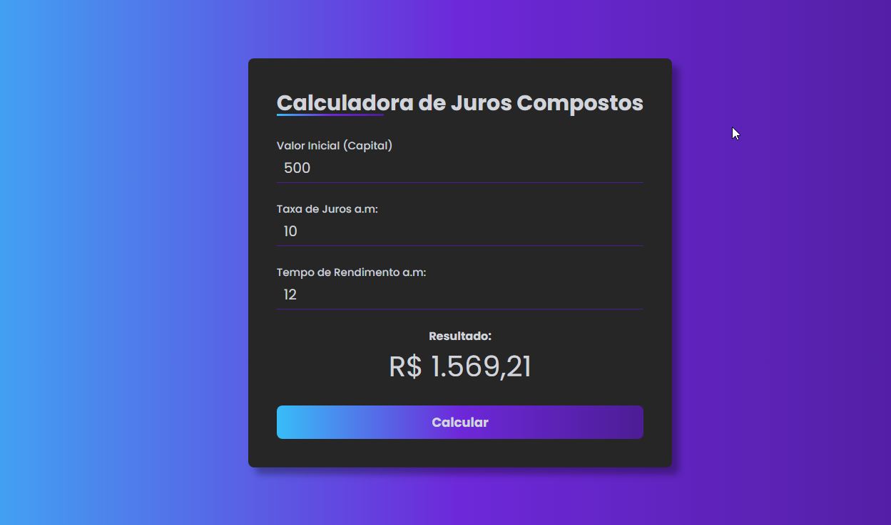

  

<h3 align="center">Calculadora de Juros Compostos</h3>

   
  

---

 Projeto de calculo de juros valor inicial + taxa de juros mês + tempo de rendimento.
      

## 📝 Índice
+ [Sobre](#sobre)
+ [Realizando o Deploying](#deployment)
+ [Uso](#uso)
+ [Feito](#feito_com)
+ [Autores](#autores)

## 🧐 Sobre 
Então, estamos trabalhando em um projeto de programação para criar uma calculadora de juros compostos. O objetivo é criar uma ferramenta simples onde alguém possa inserir três informações básicas: o valor inicial do investimento ou empréstimo, a taxa de juros mensal e a duração do investimento em meses. Com base nessas informações, a calculadora vai mostrar quanto o investimento vai valer no futuro.

## 🎈 Uso 
- Valor Inicial: Este é o montante de dinheiro que você está investindo inicialmente Digite o valor inicial do seu investimento.

- Taxa de Juros por Mês: Esta é a taxa de juros que será aplicada a cada mês ao seu investimento. Por exemplo, se a taxa de juros é de 1% ao mês, você digitaria 1 nesta caixa.

- Número de Meses: Este é o período de tempo, em meses, durante o qual os juros serão calculados. Por exemplo, se você deseja calcular os juros compostos ao longo de um período de 12 meses, digite 12 nesta caixa.

## 🚀 Realizando o Deploying 
Deploy realizado no proprio GitHub Pages.  
[Deploy](https://lucasserafimx.github.io/calc-juros-compostos/)

## ⛏️ Feito 

## ✍️ Autores 
- [@LucasSerafimx](https://github.com/LucasSerafimx) - Ideia & Trabalho inicial
s
